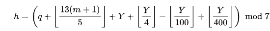

# Zeller's congruence

[Zeller's congruence](https://en.wikipedia.org/wiki/Zeller%27s_congruence)
is an algorithm devised by Christian Zeller in the 19th century to calculate
the day of the week for any Julian or Gregorian calendar date.

Current implementation of program is designed for Gregorian calendar
and based on the formula: 

